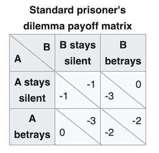

# Matt_Portfolio
My Programming and Data Science Portfolio

##Data Science and Statistics

### [Project 1: NCAA Unbiased Rankings](https://github.com/mattgevercer/Computing-and-Machine-Learning-for-Economics/tree/main/ColleyRank)
* Adapted Colley's unbiased method for ranking college football teams into python code using 2 different algorithms.
* Wrote python code that scrapes historical NCAA football data from the web. 
* [Click here for full description of the Colley Method](https://www.colleyrankings.com/matrate.pdf)

### [Project 2: World Bank Data Scraper](https://github.com/mattgevercer/Computing-and-Machine-Learning-for-Economics/tree/main/World_Bank_Import)
* Scrapes data for any given economic indicator from any given year on the World Bank website.
* Parses the website's HTML using Beautiful Soup and outputs the data in a pandas DataFrame. 
* [Click here for descriptions of World Bank Indicators](https://data.worldbank.org/indicator)

##Machine Learning and Deep Learning

### [Project 3: Classifying Handwritten Digits](https://github.com/mattgevercer/Digit-Recognition)
* A computer vision program that shows the difference in accuracy for guessing handwritten digits between a regular dense neural network and a convolutional dense neural network. 
* Visualizes how accuracy of predicting validation data improves over epochs. 
* Achieved over 98% accuracy in classifying handwritten digits.
* [Click here for dataset documentation](http://yann.lecun.com/exdb/mnist/)

### [Project 4: Predicting House Prices](https://github.com/mattgevercer/Cali_Housing)
* A dense neural network to predict the price of houses in California. 
* Splits housing data into training and testing sets. 
* Utilizes a callback to stop training once MSE loss has dropped below 0.5. 
* Visualizes training loss versus validation loss over the epochs to gauge overfitting in model. 
* [Click here for dataset documentation](https://scikit-learn.org/stable/modules/generated/sklearn.datasets.fetch_california_housing.html)

##Reinforcement Learning

### [Project 5: The Prisoner's Dilemma](https://github.com/mattgevercer/Prisoners_Dilemma)
* Creates a simple reinforcement learning environment (adapted from Open AI's gym) to simulate the Prisoner's Dilemma.
* Simulates the Prisoner's Dilemma game between two epsilon-decreasing agents over 1000 Monte Carlo episodes. 
* Tracks learning progess with a barplot and shows convergence towards a mutual defection strategy.
* [Click here for more information on the Prisoner's Dilemma](https://www.investopedia.com/terms/p/prisoners-dilemma.asp)

  

## [Project 4: PageRank](https://github.com/mattgevercer/PageRank)
* A program that ranks web pages based on importance for use in a search engine. 
* Samples states randomly from a Markov Chain to estimate each page's rank. 
* [Click here for in-depth project description](https://cs50.harvard.edu/ai/2020/projects/2/pagerank/)

## [Project 5: Degrees](https://github.com/mattgevercer/Degrees)
* Finds the shortest path between any two actors using a breadth-first search algorithm. 
* Returns the "path" (i.e. the films where two connected actors appeared with eachother). 
* Returns the "steps" in the path (i.e. the number of degrees between the two actors). 
* [Click here for in-depth project description](https//cs50.harvard.edu/ai/2020/projects/0/degrees/)
